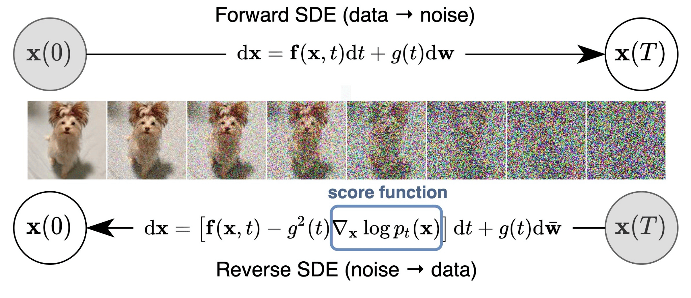
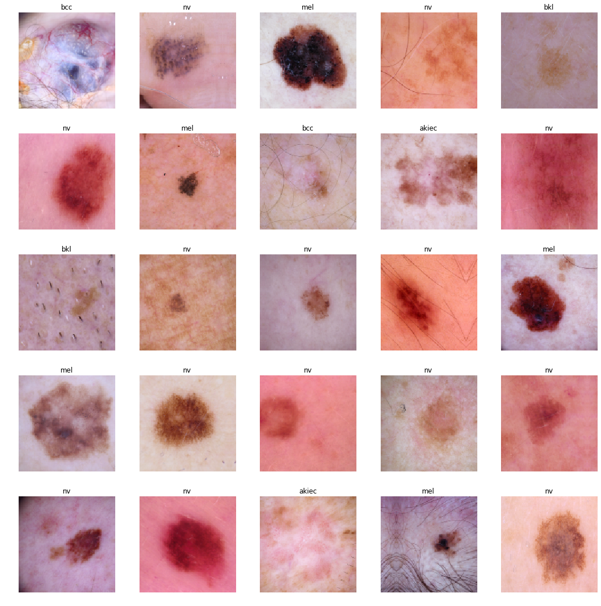
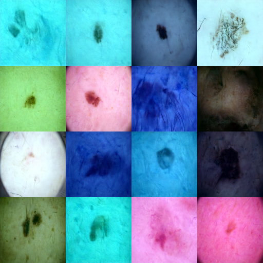
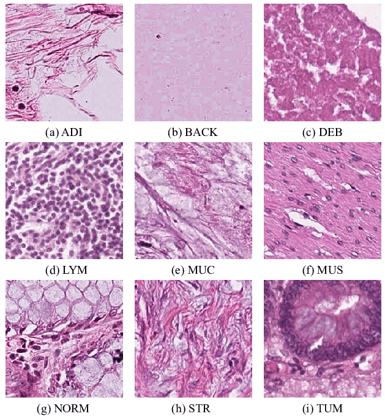
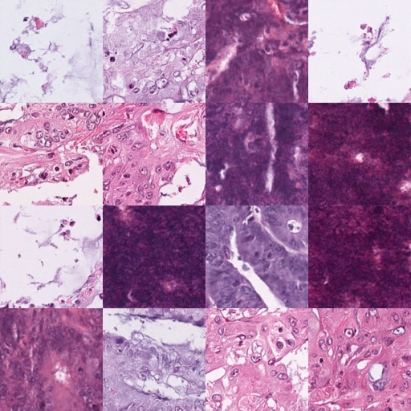

# Diffusion Models
Diffusion models are a class of generative models used for tasks like image generation. They are based on the idea of simulating a diffusion process, where a series of noisy observations are generated from a given initial state through a sequence of steps. The goal of the model is to learn the underlying distribution of the initial state that leads to the observed data.

## Own Implementation
You can train a simple U-Net based diffusion model via the Notebook [unet_2d.ipynb](unet_2d.ipynb).

## Current Results
I just tried out two different kind of datasets: MNIST HAM 1000 and NCT-CRC-HE-100K (just one class here)

### MNIST HAM 1000
<u>Real Images:</u>

<u>Generated Images:</u>

### NCT-CRC-HE-100K
<u>Real Image (all classes):</u>

<u>Generated Images (Class: MUS):</u>

